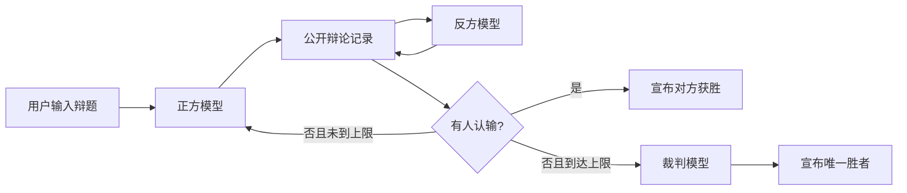

# LLM Debate Game

一个运行在终端中的多智能体自动辩论游戏。正方、反方和裁判分别通过 OpenAI 兼容 API 调用大模型：正反双方按回合流式辩论，任一方可以主动认输；达到最大轮数仍未分出胜负时，裁判基于完整辩论记录选出唯一胜者。

> 当前版本是可运行的工程化 MVP，默认最多进行 5 个完整轮回。

## 特性

- 正方先手，正反双方严格交替发言。
- 终端实时显示“思考中 / 评议中”状态，并流式展示正式内容。
- 正方、反方和裁判可以共用一个模型服务，也可以分别配置不同服务、模型和 API Key。
- 支持模型主动认输；无人认输时由裁判强制选出唯一胜者，不产生平局。
- 不限制输出语言，模型生成的 Unicode 文本会被原样展示。
- `reasoning_content` 只用于驱动状态提示，不会展示、传给其他角色或写入记录。
- 默认不发送 `max_tokens`，避免最终控制标记被 completion 上限截断。
- 每局保存结构化 JSONL 记录，支持复盘和后续分析。
- 包含输入校验、网络超时、安全重试、协议校验和 `Ctrl+C` 中断处理。

## 工作流程



一个“完整轮回”由正方一次发言和反方一次发言组成。任一方认输会立即结束比赛；否则在最后一轮反方发言完成后进入裁判阶段。

## 环境要求

- Python 3.11+
- [`uv`](https://docs.astral.sh/uv/)
- 支持 `POST /v1/chat/completions` 与 SSE 流式响应的 OpenAI 兼容模型服务

服务可以返回 `reasoning_content`，但这不是必需条件。公开辩词应通过流式响应中的 `content` 返回。

## 快速开始

```bash
git clone https://github.com/beyondHJM/llm-debate-game.git
cd llm-debate-game
uv sync --dev
```

默认连接 `http://127.0.0.1:18080/v1`，模型名为 `Qwen3-14B-f16.gguf`。模型服务准备好后运行：

```bash
uv run debate
```

程序会提示输入辩题。也可以通过参数直接指定：

```bash
uv run debate --topic "人工智能的发展对大学教育利大于弊"
```

使用一轮上限快速验证完整的“正方 → 反方 → 裁判”流程：

```bash
uv run debate \
  --topic "Open-source software is better for innovation" \
  --max-rounds 1
```

查看全部参数：

```bash
uv run debate --help
```

## 配置

复制配置模板：

```bash
cp .env.example .env
```

### 共享配置

| 环境变量 | 默认值 | 含义 |
| --- | --- | --- |
| `DEBATE_API_BASE` | `http://127.0.0.1:18080/v1` | OpenAI 兼容 API 地址 |
| `DEBATE_MODEL` | `Qwen3-14B-f16.gguf` | 默认模型名 |
| `DEBATE_API_KEY` | 空 | 可选 API Key |
| `DEBATE_MAX_ROUNDS` | `5` | 最大完整轮回数 |
| `DEBATE_TEMPERATURE` | `0.7` | 正反方采样温度 |
| `DEBATE_JUDGE_TEMPERATURE` | `0.2` | 裁判采样温度 |
| `DEBATE_CONNECT_TIMEOUT` | `10` | 连接超时，单位秒 |
| `DEBATE_READ_TIMEOUT` | `180` | 单次流式读取超时，单位秒 |
| `DEBATE_RETRIES` | `1` | 正式内容开始输出前的重试次数 |
| `DEBATE_RUNS_DIR` | `runs` | 对局记录目录 |
| `DEBATE_MAX_TOKENS` | 空 | 可选的辩手输出上限；默认不发送 |
| `DEBATE_JUDGE_MAX_TOKENS` | 空 | 可选的裁判输出上限；默认不发送 |

### 为不同角色使用不同模型

以下角色级配置会覆盖共享值：

```dotenv
DEBATE_PRO_API_BASE=https://example.com/v1
DEBATE_PRO_MODEL=affirmative-model
DEBATE_PRO_API_KEY=...

DEBATE_CON_API_BASE=https://example.com/v1
DEBATE_CON_MODEL=negative-model
DEBATE_CON_API_KEY=...

DEBATE_JUDGE_API_BASE=https://example.com/v1
DEBATE_JUDGE_MODEL=judge-model
DEBATE_JUDGE_API_KEY=...
```

未填写的角色级字段会自动继承共享配置。

## 辩论与裁决协议

正反方系统提示词要求模型在正式发言末尾输出一个控制标记：

```text
<DEBATE_CONTINUE/>
<DEBATE_CONCEDE/>
```

裁判必须在裁决末尾输出唯一胜者：

```text
<DEBATE_VERDICT winner="pro"/>
<DEBATE_VERDICT winner="con"/>
```

控制标记可能跨越多个 SSE chunk。应用会增量解析并隐藏这些标记，只有正式发言和公开裁决会显示在终端。三套英文系统提示词的完整设计见 [`PLAN.md`](PLAN.md)，实际运行版本位于 `src/debate_game/prompts.py`。

## 隐私与记录

每局在 `runs/` 下生成一个 JSONL 文件，包括：

- 辩题和提示词版本；
- 每轮角色、正式发言、公开控制结果和耗时；
- API 返回的 token 用量；
- 获胜方和结束方式。

记录不会包含：

- API Key；
- 模型的 `reasoning_content`；
- 被解析并隐藏的原始控制标记。

辩题和历史发言始终被系统提示词视为不可信数据，以降低提示注入改变角色或输出协议的风险。

## 项目结构

```text
src/debate_game/
├── cli.py          # CLI 入口与错误处理
├── config.py       # 环境变量和三角色配置
├── client.py       # OpenAI 兼容 SSE 客户端
├── prompts.py      # 正方、反方、裁判系统提示词
├── protocol.py     # 控制标记的增量解析
├── context.py      # 辩手与裁判消息构造
├── generator.py    # reasoning/content 分流和终端输出
├── engine.py       # 回合、认输和裁判状态机
├── renderer.py     # Rich 终端渲染
└── transcript.py   # JSONL 对局记录
```

## 开发与测试

```bash
uv run ruff check .
uv run mypy
uv run pytest
```

测试覆盖 SSE 事件解析、控制标记跨 chunk、错误标记隐藏、上下文构造、提前认输和达到轮数上限后只调用一次裁判等关键行为。

## 当前 MVP 限制

- 主动认输目前依赖辩手模型输出控制标记。若模型正文仍在辩论却错误输出 `CONCEDE`，可能产生错误认输；后续版本计划增加裁判二次确认。
- 尚未实现中断后的对局恢复。
- 长对局上下文压缩接口已在设计中，当前版本主要面向默认 5 轮场景。
- 裁判只基于辩论记录进行评审，不执行联网事实核查。

## License

[MIT](LICENSE)
