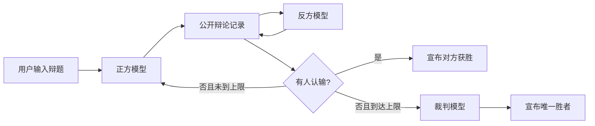

# LLM Debate Game

一个同时提供终端和网页界面的多智能体自动辩论游戏。正方、反方和裁判分别通过 OpenAI 兼容 API 调用大模型：正反双方按回合流式辩论，任一方可以主动认输；达到最大轮数仍未分出胜负时，裁判基于完整辩论记录选出唯一胜者。两个界面共享同一个辩论引擎，不会产生两套规则。

> 当前版本是可运行的工程化 MVP，默认最多进行 5 个完整轮回。

## 特性

- 正方先手，正反双方严格交替发言。
- 终端和网页均实时显示“思考中 / 评议中”状态，并流式展示正式内容。
- 网页使用左右气泡呈现正反方发言，裁判结果独立居中展示。
- 网页中的思考过程可以按气泡独立展开；思考和正式发言均支持 Markdown。
- 网页实时显示正式输出 token/s；展开思考面板后会单独显示思考 token/s。
- 用户停留在页面底部时自动跟随流式输出；向上滚动后立即停止自动跟随。
- 网页刷新后可以恢复当前服务进程中仍保留的对局，并支持主动停止。
- 正方、反方和裁判可以共用一个模型服务，也可以分别配置不同服务、模型和 API Key。
- 支持模型主动认输；无人认输时由裁判强制选出唯一胜者，不产生平局。
- 不限制输出语言，模型生成的 Unicode 文本会被原样展示。
- `reasoning_content` 可在网页中按需查看，但不会传给其他角色或写入对局记录。
- 默认不发送 `max_tokens`，避免最终控制标记被 completion 上限截断。
- 每局保存结构化 JSONL 记录，支持复盘和后续分析。
- 包含输入校验、网络超时、安全重试、协议校验、终端中断和网页取消处理。

## 工作流程



一个“完整轮回”由正方一次发言和反方一次发言组成。任一方认输会立即结束比赛；否则在最后一轮反方发言完成后进入裁判阶段。

## 环境要求

- Python 3.11+
- 支持 `POST /v1/chat/completions` 与 SSE 流式响应的 OpenAI 兼容模型服务

服务可以返回 `reasoning_content`，但这不是必需条件。公开辩词应通过流式响应中的 `content` 返回。

## 安装

确认当前命令行中的 Python 版本不低于 3.11：

```bash
python --version
```

克隆项目并进入项目目录：

```bash
git clone https://github.com/beyondHJM/llm-debate-game.git
cd llm-debate-game
```

使用准备运行本项目的同一个 `python` 安装项目及运行依赖：

```bash
python -m pip install -e .
```

`-e` 表示可编辑安装，修改本地代码后不需要重新安装。安装完成后可以确认版本：

```bash
python -c "import debate_game; print(debate_game.__version__)"
```

预期输出 `0.2.1`。后续安装、命令行启动和网页启动都应使用同一个 `python`。

## 首次配置

复制三个角色的配置模板，移除文件名中的 `.example`，然后分别填写模型服务信息：

```text
configs/affirmative.example.json → configs/affirmative.json
configs/negative.example.json    → configs/negative.json
configs/judge.example.json       → configs/judge.json
```

## 启动

### 命令行启动

```bash
python -m debate_game
```

程序会提示输入辩题。也可以通过参数直接指定：

```bash
python -m debate_game --topic "人工智能的发展对大学教育利大于弊"
```

使用一轮上限快速验证完整的“正方 → 反方 → 裁判”流程：

```bash
python -m debate_game --topic "Open-source software is better for innovation" --max-rounds 1
```

### 网页启动

```bash
python -m debate_game.web
```

默认自动打开 `http://127.0.0.1:8000`。如需从局域网中的其他设备访问：

```bash
python -m debate_game.web --host 0.0.0.0 --port 8000 --no-open-browser
```

不要将未配置鉴权的服务直接暴露到公网。模型 API Key 只在 Python 服务端读取，不会发送给浏览器。

每个正方、反方和裁判气泡旁都有独立的思考按钮。模型 API 返回了
`reasoning_content` 时可以展开查看；没有返回时按钮显示“无思考”。网页对思考内容
和正式发言执行 CommonMark 渲染，并禁用模型输出中的原始 HTML。数学公式支持
`$...$`、`$$...$$`、`\(...\)` 和 `\[...\]` LaTeX 分隔符；类似
`0.\overline{9}` 的单个裸 LaTeX 命令也会自动转换为 MathML。

## 配置

默认读取三个互相独立的 JSON 文件：

```text
configs/affirmative.json  # 正方
configs/negative.json     # 反方
configs/judge.json        # 裁判
```

每个文件使用相同结构，可以连接不同服务和模型：

```json
{
  "api_base": "https://api.deepseek.com",
  "api_key": "replace-with-your-api-key",
  "model": "deepseek-flash",
  "temperature": 0.7,
  "connect_timeout": 10,
  "read_timeout": 180,
  "retries": 1
}
```

`max_tokens` 是可选字段，默认不发送，避免模型在最终控制标记前被截断。三个真实配置文件已被 `.gitignore` 排除，不会随正常的 `git add .` 提交。

如需临时使用其他配置文件，可以传入：

```bash
python -m debate_game --pro-config configs/pro-local.json --con-config configs/con-local.json --judge-config configs/judge-local.json
```

网页版支持相同的三个配置文件参数。所有平台统一使用 `python -m debate_game` 和 `python -m debate_game.web`，不再维护平台专属启动脚本。

## 辩论与裁决协议

正反方系统提示词要求模型在正式发言末尾输出一个控制标记：

```text
<DEBATE_CONTINUE/>
<DEBATE_CONCEDE/>
```

裁判必须在裁决末尾输出唯一胜者：

```text
<DEBATE_VERDICT winner="pro"/>
<DEBATE_VERDICT winner="con"/>
```

控制标记可能跨越多个 SSE chunk。应用会增量解析并隐藏这些标记，只有正式发言和公开裁决会显示在终端或网页中。三套英文系统提示词的完整设计见 [`PLAN.md`](PLAN.md)，实际运行版本位于 `src/debate_game/prompts.py`。

## 隐私与记录

每局在 `runs/` 下生成一个 JSONL 文件，包括：

- 辩题和提示词版本；
- 每轮角色、正式发言、公开控制结果和耗时；
- API 返回的 token 用量；
- 获胜方和结束方式。

记录不会包含：

- API Key；
- 模型的 `reasoning_content`；
- 被解析并隐藏的原始控制标记。

辩题和历史发言始终被系统提示词视为不可信数据，以降低提示注入改变角色或输出协议的风险。

## 项目结构

```text
src/debate_game/
├── cli.py             # 命令行入口与错误处理
├── web_cli.py         # 网页服务入口
├── config.py          # 三角色 JSON 配置加载与校验
├── client.py          # OpenAI 兼容 SSE 客户端
├── prompts.py         # 正方、反方、裁判系统提示词
├── protocol.py        # 控制标记的增量解析
├── context.py         # 辩手与裁判消息构造
├── generator.py       # reasoning/content 分流和统一事件发布
├── events.py          # CLI 与 Web 共享的流式事件
├── cancellation.py    # 统一取消令牌
├── engine.py          # 回合、认输和裁判状态机
├── renderer.py        # Rich 终端事件消费者
├── transcript.py      # JSONL 对局记录
└── web/
    ├── app.py          # FastAPI、REST API 和 SSE
    ├── sessions.py     # 隔离的网页对局会话
    └── static/         # 原生 HTML/CSS/JavaScript 气泡界面
```

## 开发与测试

```bash
python -m ruff check .
python -m mypy
python -m pytest
```

开发依赖可以通过 `uv sync --dev` 安装。测试覆盖模型 SSE 解析、网页 API、会话事件回放、控制标记跨 chunk、上下文构造、提前认输和达到轮数上限后只调用一次裁判等关键行为。

## 当前 MVP 限制

- 主动认输目前依赖辩手模型输出控制标记。若模型正文仍在辩论却错误输出 `CONCEDE`，可能产生错误认输；后续版本计划增加裁判二次确认。
- 网页刷新可以从服务内存回放对局事件，但服务进程重启后不能从 JSONL 恢复运行中的对局。
- 长对局上下文压缩接口已在设计中，当前版本主要面向默认 5 轮场景。
- 裁判只基于辩论记录进行评审，不执行联网事实核查。

## License

[MIT](LICENSE)
